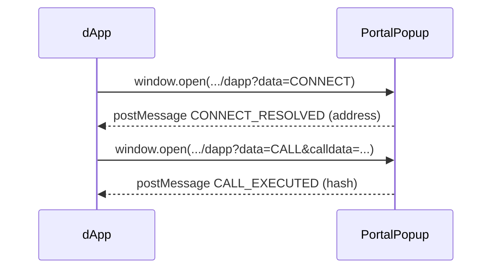
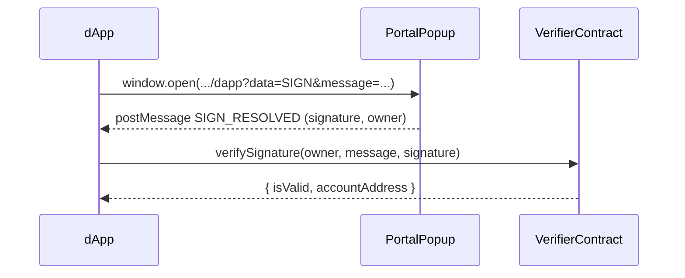

# Incentiv dApp SDK

> **JavaScript / TypeScript client that lets any web dApp send transactions through the Incentiv Portal.**

[](https://www.npmjs.com/package/@incentiv/dapp-sdk)
[](#license)

---

Incentiv uses a proprietary signing flow that lives inside the **Incentiv Portal**. Trying to reproduce that logic inside your dApp would be brittle, insecure, and would violate the user‑experience guidelines of the network.

The **Incentiv dApp SDK** solves this by:

* Opening a secure pop‑up in the Incentiv Portal when you need the user to sign.
* Submitting the resulting *UserOperation* on your behalf.
* Returning the **UserOperation hash** so that you can track it afterwards.
* Providing an `IncentivSigner` with a familiar `sendTransaction()` API built on top of [`ethers.js v6`](https://docs.ethers.org/v6/).

---

## Features

* **Zero private‑key handling** in your site – users sign inside the Portal
* **`IncentivSigner`** → AA-aware signer with a `sendTransaction()` API + UserOp `wait()` semantics
* **`IncentivResolver`** → low‑level helper if you don't use ethers
* Supports **Staging**, **Testnet** & **Mainnet** (or any custom Portal URL)
* Ships with **TypeScript types**

---

## Installation

```bash
npm install @incentiv/dapp-sdk ethers@^6.13.0      # ethers v6 is required
# or
yarn add @incentiv/dapp-sdk ethers@^6.13.0
```

> Requires **ethers v6.x**. For the v5-compatible release, install `@incentiv/dapp-sdk@^0.1.9`.

---

## Quick start

```ts
import { IncentivSigner, IncentivResolver } from "@incentiv/dapp-sdk";
import { Interface, JsonRpcProvider, parseEther } from "ethers";

/**
 * Choose which Incentiv environment you want to talk to
 */
const Environment = {
  Portal: "https://portal.incentiv.io",
  RPC: "https://rpc.incentiv.io",
  EntryPoint: "0x3eC61c5633BBD7Afa9144C6610930489736a72d4",
  VerifierContract: "0xd44EbfDf4FFf3e367b7e07e47eA0e70F5277Bca0",
};

async function main () {
  // Ask the Portal to connect and give us the user's address
  const address = await IncentivResolver.getAccountAddress(Environment.Portal);

  // Standard ethers v6 provider
  const provider = new JsonRpcProvider(Environment.RPC, undefined, { staticNetwork: true });

  // AA-aware signer
  const signer = new IncentivSigner({
    address,
    provider,
    environment: Environment.Portal,
    entryPoint: Environment.EntryPoint,
    verifierContract: Environment.VerifierContract
  });

  // Encode the contract call manually — IncentivSigner is not a drop-in
  // ethers.Signer (see "Sending contract calls" below).
  const iface = new Interface(["function transfer(address to, uint256 amount)"]);
  const data = iface.encodeFunctionData("transfer", ["0xRecipient", 1000n]);

  // Send a transaction – the Portal pop‑up will appear automatically
  const tx = await signer.sendTransaction({
    to: "0xYourContract",
    data,
    value: parseEther("0.01")
  });

  console.log("UserOperation hash:", tx.hash);

  // Wait for the UserOp to be mined
  const receipt = await tx.wait(60_000);
  console.log("Mined in block:", receipt.blockNumber, "status:", receipt.status);
}

main().catch(console.error);
```

### Sending contract calls

As of `0.2.0`, `IncentivSigner` no longer extends `ethers.Signer` / `AbstractSigner`,
so it cannot be passed directly to `new ethers.Contract(addr, abi, signer)` for
write calls. Encode the calldata yourself and call `sendTransaction()`:

```ts
import { Contract, Interface } from "ethers";

// Reads — use the provider directly
const reader = new Contract(addr, abi, provider);
const value  = await reader.storedValue();

// Writes — encode calldata, then send through IncentivSigner
const iface = new Interface(abi);
const data  = iface.encodeFunctionData("setValue", [42]);
const tx    = await signer.sendTransaction({ to: addr, data, value: 0 });
await tx.wait();
```

See `MIGRATION.md` for the full v5 → v6 cheat‑sheet.

### Browser‑only

`IncentivResolver` and `IncentivSigner` rely on `window.open` and `postMessage`, therefore they **must** run in a browser context (NodeJS & SSR are *not* supported).

---

## Message Signing

The SDK supports signing arbitrary messages through the Incentiv Portal and verifying those signatures on-chain. This is useful for authentication, proof of ownership, and other use cases where you need cryptographic proof without sending a transaction.

### Signing Flow

1. **`IncentivSigner.signMessageDetailed()`** → Opens Portal popup → Returns signature + owner data
2. **`IncentivSigner.verifySignature()`** → Calls Verifier contract → Returns validity + AA wallet address

### Example: Sign a Message

```ts
import { IncentivSigner } from "@incentiv/dapp-sdk";
import { JsonRpcProvider } from "ethers";

const Environment = {
  Portal: "https://portal.incentiv.io",
  RPC: "https://rpc.incentiv.io",
  EntryPoint: "0x3eC61c5633BBD7Afa9144C6610930489736a72d4",
  VerifierContract: "0xd44EbfDf4FFf3e367b7e07e47eA0e70F5277Bca0",
};

async function signAndVerify() {
  const provider = new JsonRpcProvider(Environment.RPC, undefined, { staticNetwork: true });

  const signer = new IncentivSigner({
    address: "0x...",  // Your user's AA wallet address
    provider,
    environment: Environment.Portal,
    entryPoint: Environment.EntryPoint,
    verifierContract: Environment.VerifierContract,
  });

  // Sign a message - Portal popup will appear
  const message = "Please sign this message to authenticate";
  const signResponse = await signer.signMessageDetailed(message);
  console.log("Signature:", signResponse.signature);
  console.log("Owner:", signResponse.owner);

  // Verify the signature on-chain
  const verification = await signer.verifySignature(
    message,
    signResponse.signature,
    signResponse.owner
  );

  console.log("Is valid:", verification.isValid);
  console.log("AA wallet address:", verification.accountAddress);
}
```

### How It Works

* **Signing**: When you call `signMessageDetailed()`, the SDK opens the Incentiv Portal in a popup window where the user can securely sign the message. The Portal returns both the signature and the owner data (the key that signed it).

* **Verification**: The `verifySignature()` method calls the on-chain Verifier contract to validate that:
  - The signature is valid for the given message and owner
  - Returns the corresponding AA wallet address for that owner

This allows you to prove that a user controls a specific AA wallet without requiring a transaction, which is perfect for authentication flows, session management, or any off-chain verification needs.

---

## API Reference

### `enum IncentivEnvironment`

| Variant | URL                            |
| ------- | ------------------------------ |
| Testnet | `https://testnet.incentiv.io` |
| Mainnet | `https://portal.incentiv.io`  |

---

### `class IncentivResolver`

| Method                                                  | Description                                                                                                                      |
| ------------------------------------------------------- | -------------------------------------------------------------------------------------------------------------------------------- |
| `static getAccountAddress(environment)`                 | Opens the Portal pop‑up with intent `CONNECT`. Resolves with the user's account address.                                         |
| `constructor(environment)`                              | Creates a resolver bound to a specific Portal URL.                                                                               |
| `sendTransaction(tx: TransactionRequest)`               | Opens the Portal pop‑up with intent `CALL`, waits for the signature & submission, then resolves with the **UserOperation hash**. |
| `sendBatchTransaction(calls: BatchCall[], options: BatchRequestOptions)` | Opens the Portal pop‑up with intent `BATCH`, executes multiple calls in a single UserOperation, then resolves with the **UserOperation hash**. |
| `getPortalUrl()`                                        | Returns the Portal URL the resolver is bound to.                                                                                 |

---

### `class IncentivSigner`

> As of `0.2.0` this class is **not** a subclass of `ethers.Signer` / `AbstractSigner`.
> See [Sending contract calls](#sending-contract-calls) for the encoding pattern.

| Method                                                  | Notes                                                                                                                                     |
| ------------------------------------------------------- | ----------------------------------------------------------------------------------------------------------------------------------------- |
| `getAccountAddress()`                                   | Same as the static resolver call but also stores the address internally.                                                                  |
| `sendTransaction(tx)`                                   | Returns an `IncentivTransactionResponse` whose `.hash` is the **UserOperation hash**. Call `.wait(timeoutMs)` to resolve once the UserOp is mined. |
| `sendBatchTransaction(calls: BatchCall[], options: BatchRequestOptions)` | Returns an `IncentivTransactionResponse` for batch transactions. Executes multiple calls in a single UserOperation with full `.wait()` support. |
| `signMessage(message)`                                  | Opens the Portal popup to sign an arbitrary message. Returns the signature as a string concatenated with the owner data via a colon separator. For ease of use, prefer `signMessageDetailed()`.   |
| `signMessageDetailed(message)`                          | Same as `signMessage()` but returns a `SignResponse` object containing the signature and owner data separately.                                 |
| `verifySignature(message, signature, owner)`            | Verifies a signature on-chain using the Verifier contract. Returns `{ isValid: boolean, accountAddress: string }`. `accountAddress` is the address of the AA wallet owned by the message signer. Requires `verifierContract` to be set in the constructor. |
| `connect(provider)`                                     | Returns a new `IncentivSigner` instance bound to the given provider.                                                                      |
| `setAccountAddress(address)`                            | Manually set / override the account address.                                                                                              |

> `signTransaction` is intentionally **unsupported** – transaction signing happens inside the Portal UI through `sendTransaction()` or `sendBatchTransaction()`.

---

### Type Definitions

#### Batch Transaction Types

```ts
interface BatchCall {
  to: string;        // Target contract address
  value?: string;    // Value to send (optional)
  data?: string;     // Encoded calldata (optional)
}

interface BatchRequestOptions {
  from: string;                    // Sender address
  gasLimit?: string;               // Gas limit (optional)
  gasPrice?: string;               // Gas price (optional)
  maxPriorityFeePerGas?: string;   // EIP-1559 priority fee (optional)
  maxFeePerGas?: string;           // EIP-1559 max fee (optional)
}
```

#### Signature Types

```ts
interface SignResponse {
  signature: string;  // The cryptographic signature
  owner: string;      // The owner/key data used to create the signature
}
```

#### UserOp Response / Receipt

```ts
interface IncentivTransactionResponse {
  hash: string;                  // UserOperation hash
  from: string;
  to?: string;
  nonce: number;
  gasLimit: bigint;
  data: string;
  value: bigint;
  chainId: bigint;
  wait: (timeoutMs?: number) => Promise<IncentivTransactionReceipt>;
}

interface IncentivTransactionReceipt {
  transactionHash: string;       // == UserOp hash (NOT the bundler tx hash)
  blockNumber: number;
  blockHash: string;
  status: number;                // 1 on success, 0 on revert
  from: string;
  to: string | null;
}
```

---

## Flow Diagrams

### Transaction Flow



### Signature Flow



---

## License

[MIT](LICENSE) © 2025 Incentiv Network
