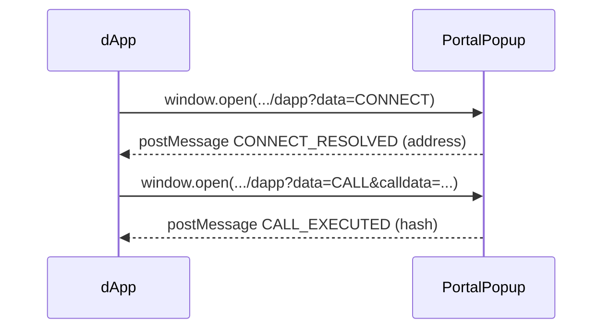

# Incentiv dApp SDK

> **JavaScript / TypeScript client that lets any web dApp send transactions through the Incentiv Portal.**

[](https://www.npmjs.com/package/@incentiv/dapp-sdk)
[](#license)

---

Incentiv uses a proprietary signing flow that lives inside the **Incentiv Portal**. Trying to reproduce that logic inside your dApp would be brittle, insecure, and would violate the user‑experience guidelines of the network.

The **Incentiv dApp SDK** solves this by:

* Opening a secure pop‑up in the Incentiv Portal when you need the user to sign.
* Submitting the resulting *UserOperation* on your behalf.
* Returning the **UserOperation hash** so that you can track it afterwards.
* Providing a drop‑in [`ethers.js`](https://docs.ethers.org/v5/) `Signer` so you can keep the rest of your code unchanged.

---

## Features

* **Zero private‑key handling** in your site – users sign inside the Portal
* **`IncentivSigner`** → works anywhere an `ethers.Signer` is expected
* **`IncentivResolver`** → low‑level helper if you don’t use ethers
* Supports **Staging**, **Testnet** & **Mainnet** (or any custom Portal URL)
* Ships with **TypeScript types**

---

## Installation

```bash
npm install @incentiv/dapp-sdk ethers@5.7.2        # ethers v5 is required
# or
yarn add @incentiv/dapp-sdk ethers@5.7.2
```

> **ethers v5.x only** for now

---

## Quick start

```ts
import { IncentivSigner, IncentivResolver } from "@incentiv/sdk";
import { ethers } from "ethers";

/**
 * Choose which Incentiv environment you want to talk to
 */
const Environment = {
  Portal:     "https://staging.incentiv.net",               // Incentiv Portal URL
  RPC:        "https://rpc.staging.incentiv.net",           // JSON‑RPC endpoint
  EntryPoint: "0xAc822ad1a236B0F2Afcc9c6b3873b864aBE1EdB9"  // EntryPoint contract
};

async function main () {
  // Ask the Portal to connect and give us the user’s address
  const address = await IncentivResolver.getAccountAddress(Environment.Portal);

  // Standard ethers provider
  const provider = new ethers.providers.StaticJsonRpcProvider(Environment.RPC);

  // Drop‑in signer – use it just like any ethers.Signer
  const signer = new IncentivSigner({
    address,
    provider,
    environment: Environment.Portal,
    entryPoint: Environment.EntryPoint
  });

  // Send a transaction – the Portal pop‑up will appear automatically
  const userOpReceipt = await signer.sendTransaction({
    to: "0xYourContract",
    data: "0x…",                                 // encoded calldata
    value: ethers.utils.parseEther("0.01")
  });

  console.log("UserOperation hash:", userOpReceipt.hash);

  // Wait for confirmation
  await userOpReceipt.wait();
}

main().catch(console.error);
```

### Browser‑only

`IncentivResolver` and `IncentivSigner` rely on `window.open` and `postMessage`, therefore they **must** run in a browser context (NodeJS & SSR are *not* supported).

---

## API Reference

### `enum IncentivEnvironment`

| Variant | URL                            |
| ------- | ------------------------------ |
| Staging | `https://staging.incentiv.net` |
| Testnet | `https://testnet.incentiv.net` |
| Mainnet | `https://incentiv.net`         |

---

### `class IncentivResolver`

| Method                                                  | Description                                                                                                                      |
| ------------------------------------------------------- | -------------------------------------------------------------------------------------------------------------------------------- |
| `static getAccountAddress(environment)`                 | Opens the Portal pop‑up with intent `CONNECT`. Resolves with the user's account address.                                         |
| `constructor(environment)`                              | Creates a resolver bound to a specific Portal URL.                                                                               |
| `sendTransaction(tx: TransactionRequest)`               | Opens the Portal pop‑up with intent `CALL`, waits for the signature & submission, then resolves with the **UserOperation hash**. |
| `sendBatchTransaction(calls: BatchCall[], options: BatchRequestOptions)` | Opens the Portal pop‑up with intent `BATCH`, executes multiple calls in a single UserOperation, then resolves with the **UserOperation hash**. |
| `getPortalUrl()`                                        | Returns the Portal URL the resolver is bound to.                                                                                 |

---

### `class IncentivSigner extends ethers.Signer`

| Method                                                  | Notes                                                                                                                                     |
| ------------------------------------------------------- | ----------------------------------------------------------------------------------------------------------------------------------------- |
| `getAccountAddress()`                                   | Same as the static resolver call but also stores the address internally.                                                                  |
| `sendTransaction(tx)`                                   | Returns a `TransactionResponse`‑like object whose `.hash` is the **UserOperation hash**. The `.wait()` method is **not implemented yet**. |
| `sendBatchTransaction(calls: BatchCall[], options: BatchRequestOptions)` | Returns a `TransactionResponse`‑like object for batch transactions. Executes multiple calls in a single UserOperation with full `.wait()` support. |
| `connect(provider)`                                     | Returns a new signer instance bound to the given provider.                                                                                |
| `setAccountAddress(address)`                            | Manually set / override the account address.                                                                                              |

> `signMessage` and `signTransaction` are intentionally **unsupported** – signing happens inside the Portal UI.

---

### Batch Transaction Types

```ts
interface BatchCall {
  to: string;        // Target contract address
  value?: string;    // Value to send (optional)
  data?: string;     // Encoded calldata (optional)
}

interface BatchRequestOptions {
  from: string;                    // Sender address
  gasLimit?: string;               // Gas limit (optional)
  gasPrice?: string;               // Gas price (optional)
  maxPriorityFeePerGas?: string;   // EIP-1559 priority fee (optional)
  maxFeePerGas?: string;           // EIP-1559 max fee (optional)
}
```

---

## Flow diagram



---

## License

[MIT](LICENSE) © 2025 Incentiv Network